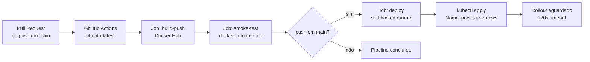

# Template Google Design Doc

Baseado no formato de design doc do Google, adaptado para o contexto do Kube-News.

Um Design Doc é usado para **documentar um sistema, componente ou feature completa** — não
uma única decisão (ADR) nem uma proposta em revisão (RFC), mas a documentação de como algo
funciona ou vai funcionar, incluindo contexto, alternativas e plano de implementação.

Use Design Doc quando: precisa documentar a arquitetura de um componente inteiro, onboarding
de um novo colaborador, ou registrar o design de uma feature que envolve múltiplas camadas.

---

## Template

```markdown
# Design Doc — <Nome do Sistema ou Componente>

**Versão:** 1.0
**Data:** AAAA-MM-DD
**Autor(es):** <nome(s)>
**Status:** Rascunho | Em Revisão | Aprovado | Implementado
**Revisores:** <nome(s)>

---

## Overview

<2-4 frases que respondem: o que é este sistema/componente, para quem ele existe, e qual
problema ele resolve. Deve ser compreensível por alguém que não conhece o projeto.>

---

## Contexto e Background

<Por que este componente foi criado? O que existia antes? Qual evento ou necessidade motivou
sua criação? Descreva o estado anterior do sistema e as limitações que tornaram esta solução
necessária.>

---

## Goals

<O que este design deve alcançar? Use itens concretos e mensuráveis.>

- <Goal 1 — específico e verificável>
- <Goal 2>

## Non-Goals

<Explicitamente o que está FORA do escopo deste design. Esta seção é tão importante quanto
Goals — previne que o documento seja usado para justificar coisas que não foram decididas.>

- <Non-Goal 1 — algo que poderia ser esperado mas não está no escopo>
- <Non-Goal 2>

---

## Design Detalhado

<Esta é a seção principal. Descreva a solução proposta com detalhe suficiente para que
alguém possa implementá-la sem perguntas adicionais.>

### Arquitetura

<Diagrama Mermaid da arquitetura. Use `flowchart TD` para visão geral, `sequenceDiagram`
para fluxos de chamada, `flowchart LR` para comparações lado a lado.>


### Componentes

<Para cada componente relevante, descreva:>

#### <Nome do Componente>
- **O que é:** <descrição>
- **Responsabilidade:** <o que ele faz>
- **Interface:** <como outros componentes interagem com ele>
- **Localização:** `<caminho/do/arquivo>`

### Fluxo de dados

<Como os dados fluem pelo sistema? De onde vêm, onde são processados, onde terminam.
Use `sequenceDiagram` para fluxos com múltiplos participantes.>

```mermaid
sequenceDiagram
    ...
```

### Configurações e variáveis de ambiente

| Variável | Valor padrão | Descrição |
|----------|-------------|-----------|
| `<VAR>` | `<valor>` | <descrição> |

---

## Alternativas Consideradas

<Para cada alternativa que foi avaliada e descartada, documente:>

### Alternativa 1: <Nome>
**Descrição:** <o que seria>
**Vantagens:** <o que seria melhor>
**Desvantagens:** <limitações>
**Por que descartada:** <argumento específico para este contexto>

### Alternativa 2: <Nome>
<idem>

---

## Segurança e Privacidade

<Quais são as considerações de segurança relevantes? Inclua:>

- **Autenticação/Autorização:** <como o acesso é controlado>
- **Dados sensíveis:** <o que é sensível e como é protegido>
- **Superfície de ataque:** <o que fica exposto e para quem>
- **Riscos conhecidos:** <o que pode dar errado e como mitigamos>

---

## Testing e Observabilidade

### Como testar

<Como verificar que o sistema funciona corretamente?>

```bash
# Comandos de verificação
```

### Endpoints de saúde

| Endpoint | Descrição | Resposta esperada |
|----------|-----------|------------------|
| `/health` | Liveness | `{"state":"up"}` |
| `/ready` | Readiness | `200 Ok` |

### Métricas disponíveis

<O que pode ser monitorado? Onde as métricas estão disponíveis?>

- `/metrics` — Prometheus via express-prom-bundle (se aplicável)

---

## Plano de Implementação

<Divida a implementação em milestones sequenciais. Cada milestone deve ser verificável.>

### Milestone 1 — <Nome>
**Critério de conclusão:** <como saber que está pronto>
- [ ] <tarefa>
- [ ] <tarefa>

### Milestone 2 — <Nome> (depende do Milestone 1)
**Critério de conclusão:** <...>
- [ ] <tarefa>

---

## Open Questions

<Perguntas que ainda precisam de resposta. Cada item deve ser fechado antes da implementação
(ou explicitamente marcado como "a ser resolvido em produção").>

- [ ] <Pergunta aberta 1>
- [ ] <Pergunta aberta 2>

---

## Apêndices

### Glossário
| Termo | Definição |
|-------|-----------|
| <termo> | <definição no contexto deste projeto> |

### Referências
- <ADR ou RFC relacionado>
- <arquivo relevante do repositório>
- <documentação externa>
```

---

## Exemplo preenchido — Pipeline de CI/CD

```markdown
# Design Doc — Pipeline de CI/CD do Kube-News

**Versão:** 1.0
**Data:** 2026-05-17
**Autor(es):** Davis Victor / Claude Sonnet 4.6
**Status:** Implementado
**Revisores:** —

---

## Overview

O pipeline de CI/CD do Kube-News automatiza o ciclo de build, validação e deploy da
aplicação a partir de um push ou pull request no GitHub. Ele garante que toda imagem
que chega ao cluster Kubernetes passou por build reproduzível e smoke test básico.

---

## Contexto e Background

Antes deste pipeline, o build e push de imagens era manual (`docker build` + `docker push`),
e o deploy era feito via `kubectl apply` direto do laptop do desenvolvedor. Isso tornava
impossível rastrear qual imagem estava em produção e criava dependência do ambiente local.
O arquivo `.github/workflows/ci-cd.yml` foi criado como parte da Fase 2 do plano de DevOps
do projeto (2026-05-17).

---

## Goals

- Automatizar build e push da imagem para o Docker Hub a cada commit em `main` ou PR
- Garantir que toda imagem publicada passou por smoke test com banco de dados real
- Rastrear a imagem em produção via tag SHA imutável (`dvsvictor/kube-news:<sha7>`)
- Automatizar o deploy no cluster local via self-hosted runner

## Non-Goals

- Suporte a múltiplos ambientes (staging, prod) — ainda não há esse requisito
- Análise estática de código (ESLint, SonarQube) — fora do escopo inicial
- Testes de integração automatizados — o projeto ainda não tem suíte de testes
- Notificações de deploy (Slack, email) — a ser adicionado futuramente

---

## Design Detalhado

### Arquitetura



### Componentes

#### Job: build-push
- **O que é:** Constrói a imagem Docker e faz push para o Docker Hub
- **Responsabilidade:** Garantir imagem reproduzível com tag rastreável
- **Interface:** Exporta `image_tag` (sha7) para os jobs seguintes
- **Localização:** `.github/workflows/ci-cd.yml:1-50`

#### Job: smoke-test
- **O que é:** Valida que a aplicação sobe com banco de dados real
- **Responsabilidade:** Detectar falhas de inicialização antes do deploy
- **Interface:** Consome `image_tag` do job anterior; falha bloqueia o deploy
- **Localização:** `.github/workflows/ci-cd.yml:51-80`

#### Job: deploy
- **O que é:** Aplica os manifestos Kubernetes no cluster local
- **Responsabilidade:** Garantir que o cluster reflete o estado do repositório
- **Interface:** Usa `KUBECONFIG_B64` secret; requer self-hosted runner com kubectl
- **Localização:** `.github/workflows/ci-cd.yml:81-120`

### Estratégia de tags de imagem

| Evento | Tags geradas |
|--------|-------------|
| Push em `main` | `dvsvictor/kube-news:<sha7>`, `dvsvictor/kube-news:main` |
| Pull Request | `dvsvictor/kube-news:<sha7>` |

A tag `main` sempre aponta para o último build aprovado. A tag SHA é imutável e usada
no `deploy.yaml` para garantir rastreabilidade.

### Configurações necessárias

| Secret GitHub | Valor | Como obter |
|--------------|-------|-----------|
| `DOCKER_USERNAME` | login Docker Hub | Hub → Account Settings |
| `DOCKER_PASSWORD` | access token | Hub → Security → New Access Token |
| `KUBECONFIG_B64` | kubeconfig base64 | `cat ~/.kube/config \| base64` |

---

## Segurança e Privacidade

- **Credenciais:** DOCKER_USERNAME, DOCKER_PASSWORD e KUBECONFIG_B64 são GitHub Secrets —
  nunca aparecem em logs ou no código
- **Kubeconfig:** decodificado em memória durante o job; arquivo removido ao final do runner
- **Superfície de ataque:** o self-hosted runner tem acesso ao cluster local — deve rodar
  em usuário sem privilégios de root
- **Risco:** se o self-hosted runner for comprometido, o atacante tem acesso ao cluster.
  Mitigação: manter o runner atualizado e isolado do resto da rede

---

## Testing e Observabilidade

### Como verificar que o pipeline funciona

```bash
# Verificar último run do pipeline
gh run list --workflow=ci-cd.yml --limit=5

# Ver logs de um run específico
gh run view <run-id> --log

# Verificar imagem no cluster após deploy
kubectl get pods -n kube-news -o jsonpath='{.items[*].spec.containers[*].image}'
```

### Endpoints de saúde

| Endpoint | Usado em | Resposta esperada |
|----------|---------|------------------|
| `GET /health` | smoke-test, livenessProbe | `{"state":"up","machine":"..."}` |
| `GET /ready` | readinessProbe | `200 Ok` |

---

## Plano de Implementação

### Milestone 1 — Pipeline básico ✅ Concluído (2026-05-17)
**Critério:** push em main dispara build, push e deploy automático
- [x] Criar `.github/workflows/ci-cd.yml`
- [x] Configurar secrets no GitHub
- [x] Instalar self-hosted runner

### Milestone 2 — Testes automatizados (futuro)
**Critério:** `npm test` com cobertura > 60% passa antes do smoke-test
- [ ] Adicionar Jest ou Mocha ao projeto
- [ ] Criar testes para endpoints /health, /ready e POST /api/post
- [ ] Integrar ao pipeline antes do job smoke-test

---

## Open Questions

- [ ] Quando adicionarmos staging, como gerenciar o `values.yaml` por ambiente?
- [ ] O self-hosted runner deve ser um serviço launchd (como o port-forward)?

---

## Apêndices

### Glossário
| Termo | Definição |
|-------|-----------|
| SHA7 | Primeiros 7 caracteres do hash do commit Git — identificador único da imagem |
| Self-hosted runner | Máquina do desenvolvedor registrada no GitHub para executar jobs |
| smoke-test | Verificação mínima que o sistema sobe sem erros óbvios |

### Referências
- ADR-0003: Usar Docker Hub como registry
- ADR-0004: Usar self-hosted runner para deploy local
- `.github/workflows/ci-cd.yml` — implementação
- `k8s/deploy.yaml` — manifestos aplicados pelo pipeline
```
