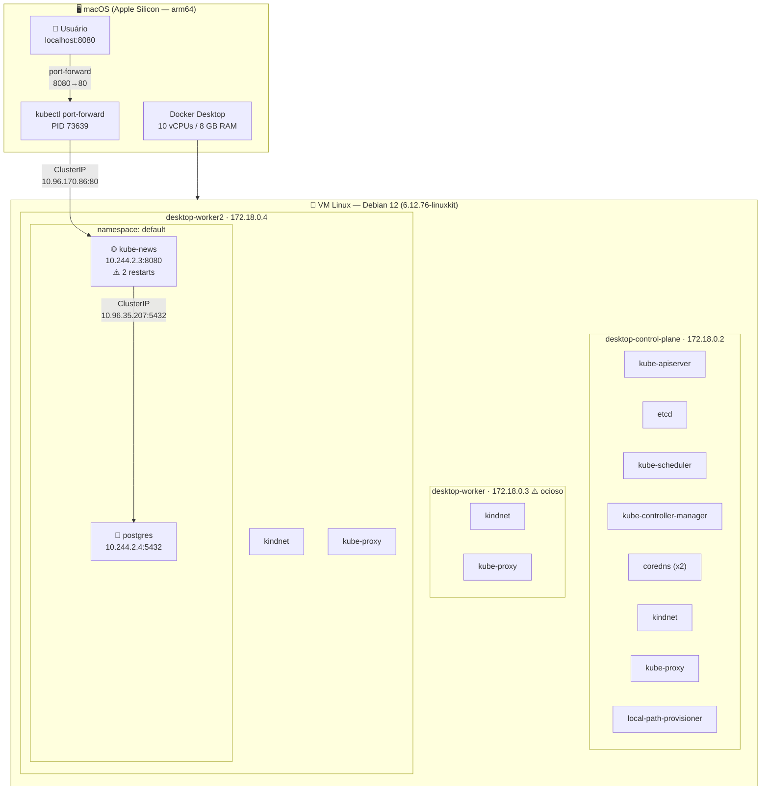
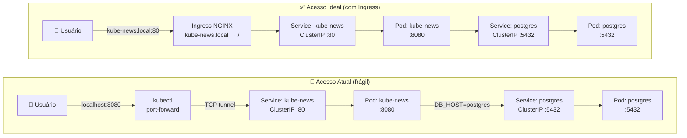
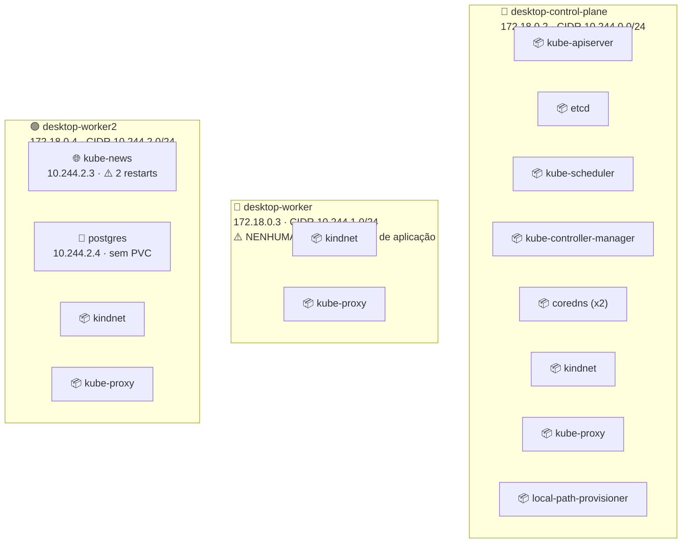
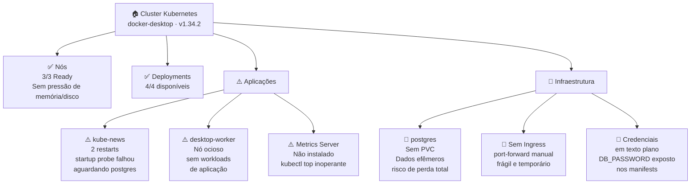
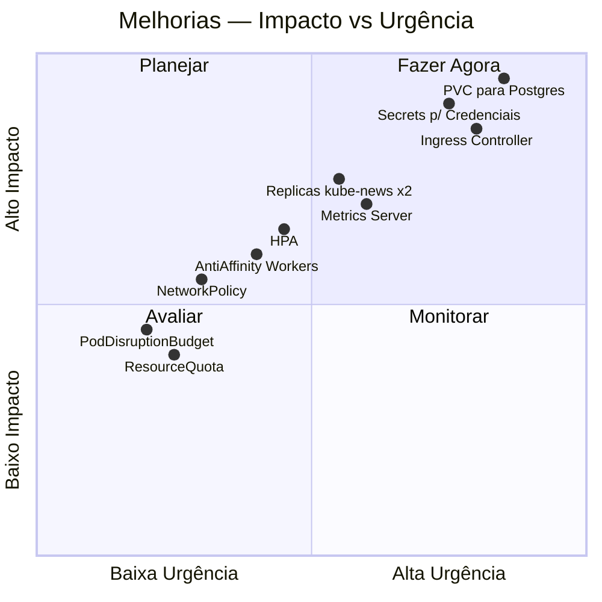
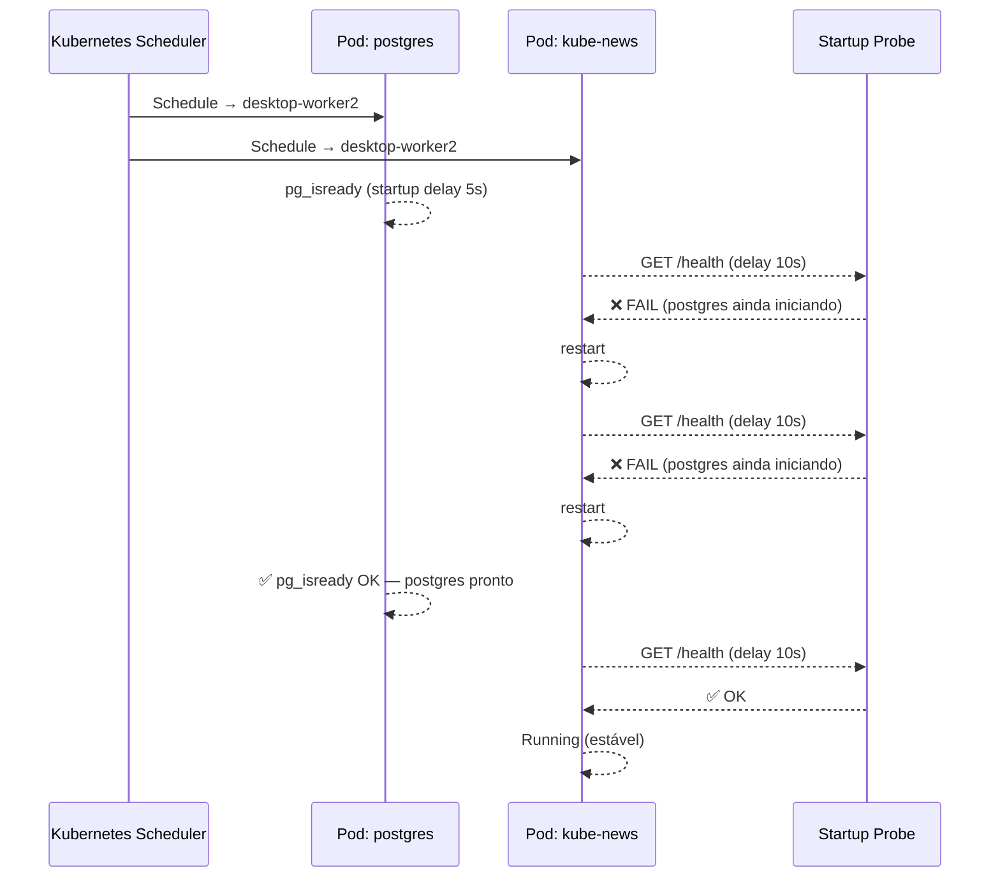

# Diagramas — Arquitetura do Cluster Kubernetes
**Gerado em:** 16/05/2026 — baseado em `relatorio_atual.md`

---

## 1. Arquitetura Geral do Cluster

Visão completa da infraestrutura: host macOS → VM Docker Desktop → nós → namespaces → pods.

---

## 2. Fluxo de Acesso à Aplicação (Atual vs. Ideal)

Comparativo entre o acesso atual via port-forward e o acesso ideal via Ingress.

---

## 3. Distribuição de Pods por Nó

Mostra onde cada pod está agendado no cluster.

---

## 4. Mapa de Saúde — Alertas e Severidade

---

## 5. Prioridade de Melhorias

---

## 6. Sequência de Inicialização dos Pods

Mostra a ordem de startup e o motivo dos 2 restarts do kube-news.

---

## Como renderizar

| Ferramenta | Como usar |
|---|---|
| **GitHub** | Abra `diagrama-palestra.md` — renderiza automaticamente |
| **VS Code** | Extensão [Mermaid Preview](https://marketplace.visualstudio.com/items?itemName=bierner.markdown-mermaid) |
| **Obsidian** | Suporte nativo a blocos `mermaid` |
| **CLI (export PNG/SVG)** | `npx mmdc -i diagrama-palestra.md -o diagrama-palestra.png` |
