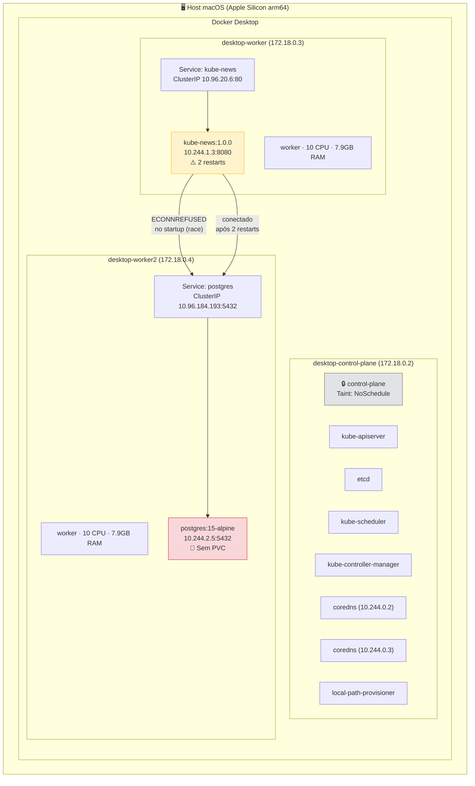
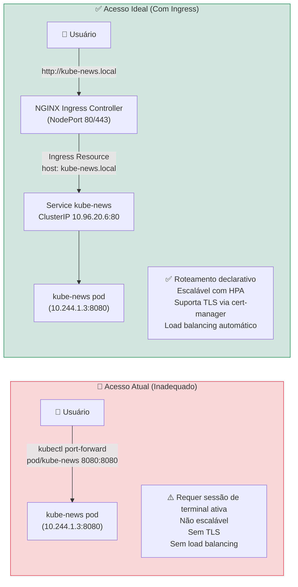
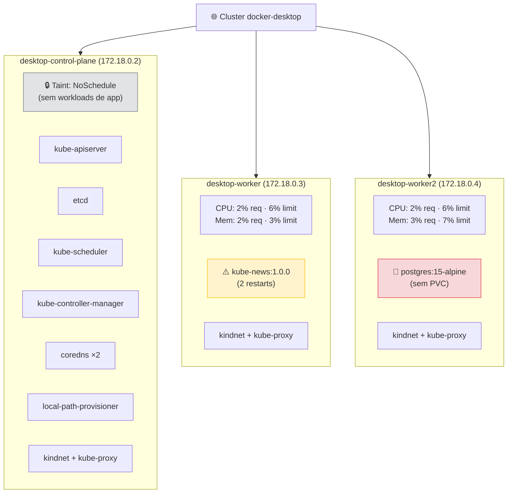
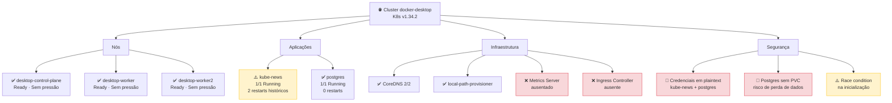
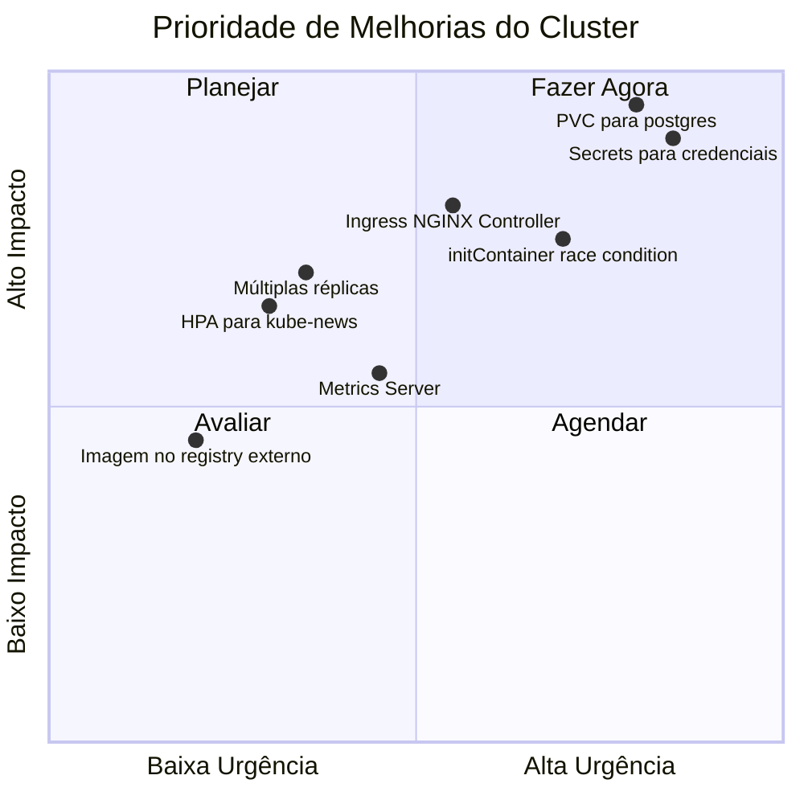
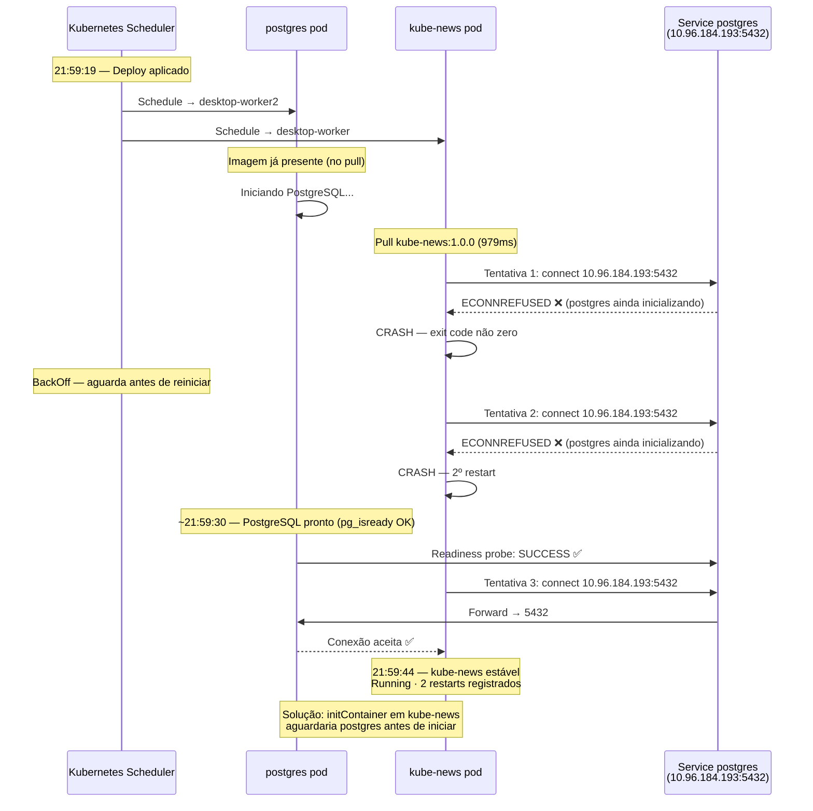

# Diagramas da Arquitetura — Kube-News Cluster
**Gerado em:** 2026-05-16 | **Cluster:** docker-desktop (kind) | **K8s:** v1.34.2

---

## Diagrama 1 — Arquitetura Geral

---

## Diagrama 2 — Fluxo de Acesso: Atual vs. Ideal

---

## Diagrama 3 — Distribuição de Pods por Nó

---

## Diagrama 4 — Mapa de Saúde do Cluster

---

## Diagrama 5 — Prioridade de Melhorias

---

## Diagrama 6 — Sequência de Inicialização (com falhas)

