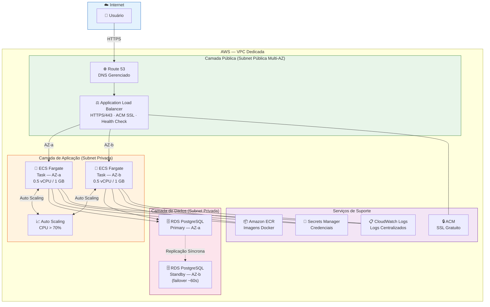
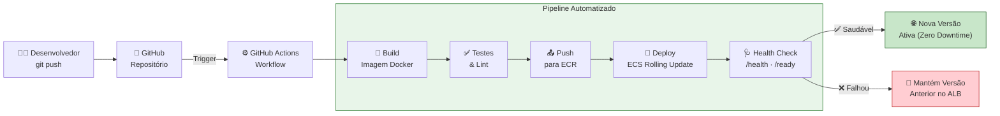
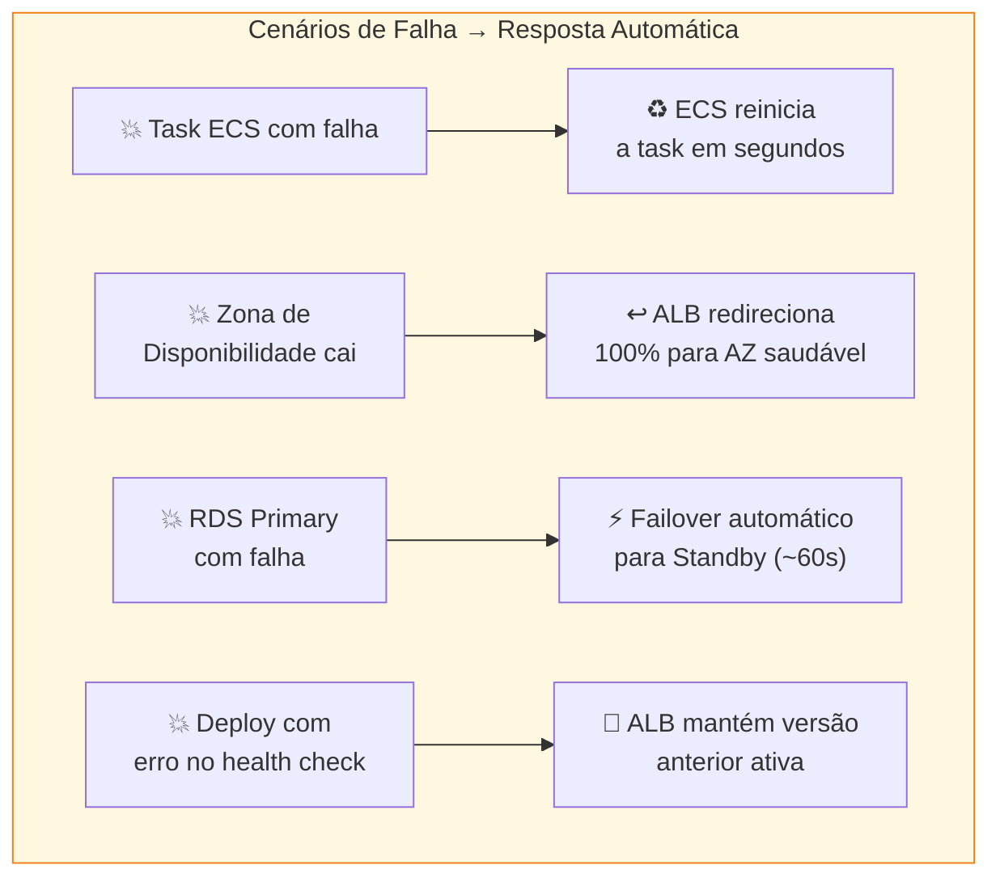
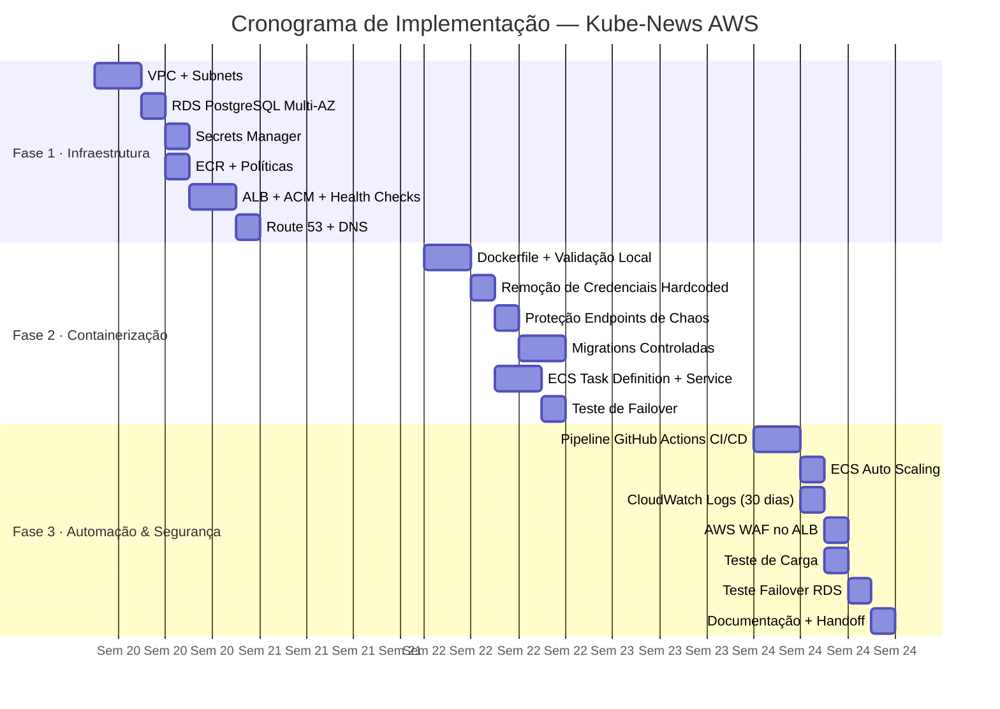
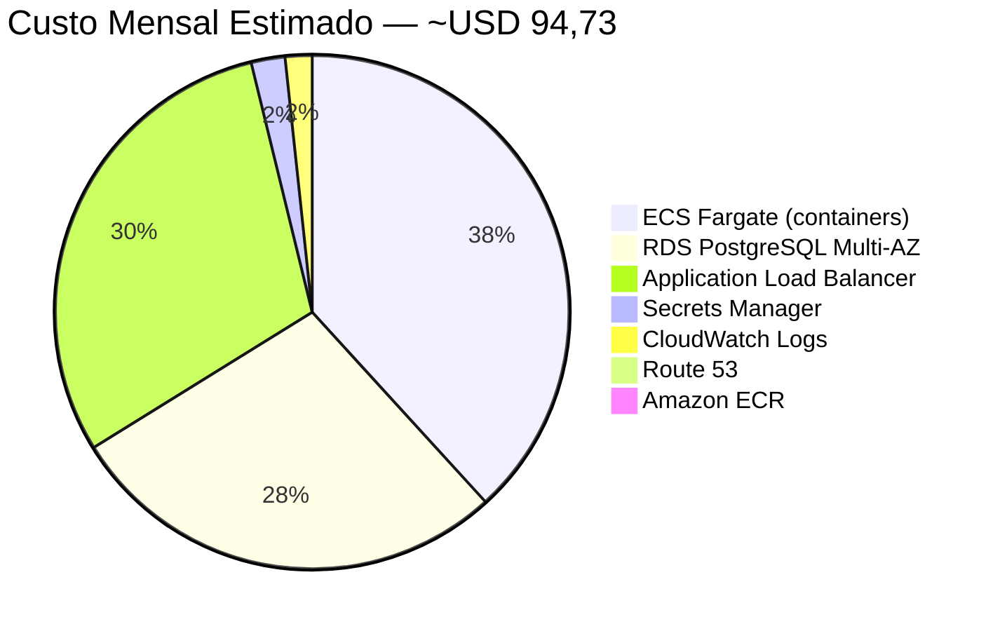

# Diagramas — Kube-News na AWS

---

## Diagrama 1 — Arquitetura Geral (Visão de Camadas)



---

## Diagrama 2 — Pipeline CI/CD (GitHub Actions)



---

## Diagrama 3 — Comportamento de Failover



---

## Diagrama 4 — Comparativo de Custo e Complexidade

```mermaid
quadrantChart
    title Custo vs Complexidade Operacional
    x-axis "Baixa Complexidade" --> "Alta Complexidade"
    y-axis "Menor Custo" --> "Maior Custo"
    quadrant-1 Caro e Complexo
    quadrant-2 Caro mas Simples
    quadrant-3 Barato mas Complexo
    quadrant-4 Barato e Simples
    ECS Fargate (proposta): [0.2, 0.42]
    Elastic Beanstalk: [0.45, 0.35]
    EC2 Auto-gerenciado: [0.85, 0.28]
    EKS Kubernetes: [0.9, 0.75]
```

---

## Diagrama 5 — Cronograma de Implementação (6 Semanas)



---

## Diagrama 6 — Custos Mensais por Serviço


