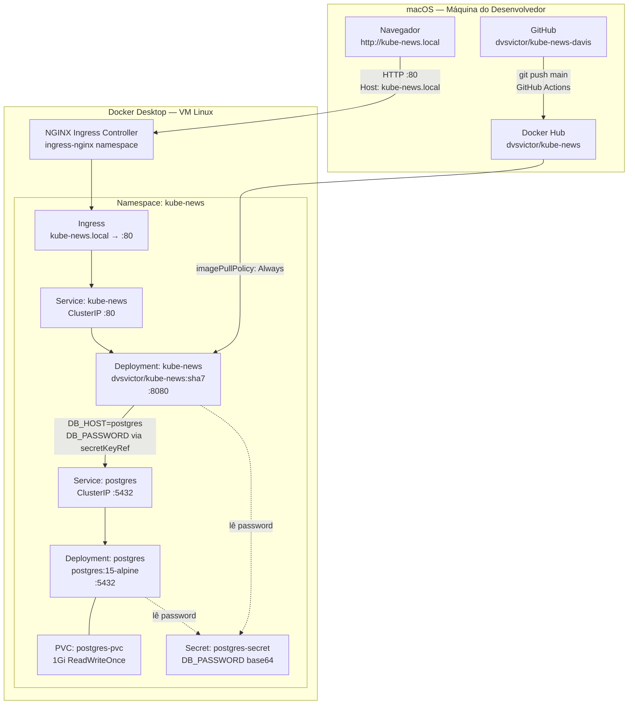
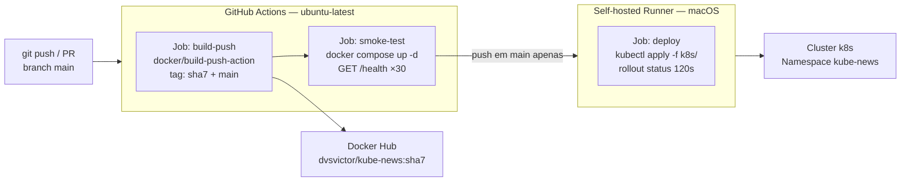
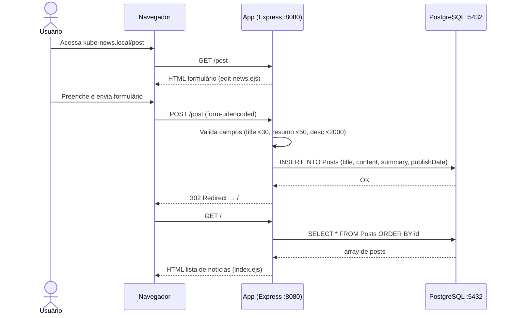

# Design Doc — Kube-News: Sistema Completo

**Versão:** 1.0
**Data:** 2026-05-17
**Autor(es):** Davis Victor / Claude Sonnet 4.6
**Status:** Implementado
**Revisores:** —

---

## Overview

Kube-News é um portal de notícias desenvolvido em Node.js 18 com PostgreSQL 15, criado para
demonstrar o ciclo completo de containerização e orquestração com Kubernetes. O sistema serve
como projeto-laboratório para práticas de DevOps: build de imagem seguro (usuário não-root,
Alpine), deploy em Kubernetes com probes, persistência via PVC, e pipeline CI/CD automatizado
com GitHub Actions. O acesso externo ao cluster local é resolvido via NGINX Ingress Controller
com entrada `kube-news.local` no `/etc/hosts`.

---

## Contexto e Background

O projeto nasceu como material de demonstração para ensinar containerização e Kubernetes na
prática. A decisão de usar um portal de notícias real (com banco de dados, templates e API)
em vez de um "Hello World" foi deliberada: as complexidades de um sistema real — dependência
entre serviços, healthchecks, persistência de dados, variáveis de ambiente — são exatamente
o que torna Kubernetes relevante.

A evolução do projeto seguiu três estágios:

| Estágio | O que foi feito |
|---------|----------------|
| **1. Containerização** | Dockerfile Alpine non-root, docker-compose com hot-reload e healthcheck alinhado com as futuras probes do K8s |
| **2. Kubernetes** | Manifestos com Deployment + Service + probes + PVC + Secret + Ingress, tudo no namespace `kube-news` |
| **3. CI/CD** | Pipeline GitHub Actions com 3 jobs (build-push → smoke-test → deploy via self-hosted runner) |

---

## Goals

- Demonstrar containerização segura: imagem Alpine, usuário não-root (`appuser`), `npm ci --omit=dev`
- Rodar em Kubernetes local (Docker Desktop) com probes de liveness, readiness e startup alinhadas ao Dockerfile
- Persistir dados do PostgreSQL via PVC (dados sobrevivem a restarts de pod)
- Proteger credenciais do banco via Kubernetes Secret (sem senha em texto plano nos manifestos)
- Automatizar build, validação e deploy via pipeline GitHub Actions
- Expor a aplicação via NGINX Ingress em `kube-news.local` sem port-forward manual

## Non-Goals

- **Múltiplos ambientes (staging, prod):** o projeto opera em um único cluster local; separação de ambiente não está no escopo atual
- **Alta disponibilidade:** replicas > 1 e estratégias canary/blue-green não foram implementadas
- **Testes automatizados:** `npm test` retorna erro — não há suíte de testes Jest/Mocha
- **Autenticação de usuários:** o portal não tem login; qualquer pessoa com acesso à rede pode criar notícias
- **TLS/HTTPS:** o Ingress opera em HTTP; HTTPS requer cert-manager ou certificado manual
- **Backup automatizado do PostgreSQL:** o PVC persiste os dados mas não há job de backup
- **Logging centralizado:** os logs ficam no stdout do pod; não há ELK, Loki ou similar

---

## Design Detalhado

### Arquitetura geral



### Arquitetura de CI/CD



### Componentes

#### Aplicação — `src/`

- **Runtime:** Node.js 18 Alpine, porta `8080` (`src/server.js:81`)
- **Framework:** Express.js com EJS para templates
- **ORM:** Sequelize — conecta ao PostgreSQL na inicialização via `models.initDatabase()`
- **Métricas:** `express-prom-bundle` expõe `/metrics` no formato Prometheus
- **Chaos:** `src/system-life.js` implementa `/unhealth` e `/unreadyfor/:seconds` para simular falhas

#### Imagem Docker — `src/Dockerfile`

```
FROM node:18-alpine          ← imagem base ~80MB
RUN adduser -S appuser       ← usuário não-root
RUN npm ci --omit=dev        ← apenas dependências de produção
USER appuser                 ← container roda sem privilégios
EXPOSE 8080
HEALTHCHECK wget /health     ← alinhado com livenessProbe do K8s
```

#### Kubernetes — `k8s/`

| Arquivo | Recurso | Descrição |
|---------|---------|-----------|
| `namespace.yaml` | Namespace `kube-news` | Isolamento de todos os recursos |
| `secrets.yaml` | Secret `postgres-secret` | `DB_PASSWORD` em base64 |
| `pvc.yaml` | PVC `postgres-pvc` (1Gi) | Dados do PostgreSQL persistidos |
| `deploy.yaml` | 2 Deployments + 2 Services | App + banco com probes completas |
| `ingress.yaml` | Ingress `kube-news.local` | Acesso HTTP via NGINX |

#### Probes do Kubernetes

As probes foram calibradas para espelhar exatamente o `HEALTHCHECK` do Dockerfile e o
`healthcheck` do `docker-compose.yml`:

| Probe | App (Node.js) | PostgreSQL |
|-------|--------------|-----------|
| **startup** | `GET /health` — 12×10s = 120s | `pg_isready` — 10×6s = 60s |
| **readiness** | `GET /ready` — 3 falhas = não pronto | `pg_isready` — 5 falhas |
| **liveness** | `GET /health` a cada 30s | `pg_isready` a cada 30s |

A `startupProbe` substitui o `depends_on: service_healthy` do Compose: impede que as
probes regulares falhem enquanto o banco ainda não subiu.

### Fluxo de dados — criação de notícia



### Variáveis de ambiente

| Variável | Valor no cluster | Origem |
|----------|-----------------|--------|
| `DB_HOST` | `postgres` | `k8s/deploy.yaml` — nome do Service |
| `DB_PORT` | `5432` | `k8s/deploy.yaml` |
| `DB_DATABASE` | `kubedevnews` | `k8s/deploy.yaml` |
| `DB_USERNAME` | `kubedevnews` | `k8s/deploy.yaml` |
| `DB_PASSWORD` | *(lido do Secret)* | `k8s/secrets.yaml` via `secretKeyRef` |
| `DB_SSL_REQUIRE` | `false` | `k8s/deploy.yaml` |

### API de endpoints

| Método | Rota | Descrição | Códigos |
|--------|------|-----------|---------|
| GET | `/` | Lista todas as notícias | 200, 500 |
| GET | `/post` | Formulário de criação | 200 |
| POST | `/post` | Criar notícia (com validação) | 302, 200, 500 |
| GET | `/post/:id` | Visualizar notícia | 200, 500 |
| POST | `/api/post` | Inserção em lote via JSON | 200, 500 |
| GET | `/health` | Liveness — `{"state":"up","machine":"<hostname>"}` | 200 |
| GET | `/ready` | Readiness — `"Ok"` ou vazio | 200, 500 |
| PUT | `/unhealth` | Força estado não saudável | 200 |
| PUT | `/unreadyfor/:s` | Simula indisponibilidade por N segundos | 200 |

---

## Alternativas Consideradas

### Alternativa 1: node:18 (Debian) como imagem base
**Vantagens:** ferramentas GNU completas, melhor compatibilidade com módulos nativos.
**Por que descartada:** tamanho ~900MB versus ~80MB do Alpine — inaceitável para pipeline de CI/CD onde build e pull acontecem a cada commit. O projeto não usa módulos com compilação C++ nativa.

### Alternativa 2: NodePort ou LoadBalancer em vez de ClusterIP + Ingress
**Vantagens:** acesso direto sem controller adicional.
**Por que descartada:** o cluster usa nós kind em rede Docker interna (`172.18.0.x`) — IPs NodePort não são roteáveis do macOS. A única solução funcional é `kubectl port-forward` (para dev) ou Ingress com NGINX Controller via porta do host.

### Alternativa 3: Kubernetes Secret gerenciado externamente (Vault, AWS Secrets Manager)
**Vantagens:** rotação automática, auditoria, sem base64 no repositório.
**Por que descartada:** adiciona dependência de infraestrutura externa desnecessária para um projeto de demonstração local. O Secret nativo é suficiente para o escopo atual.

### Alternativa 4: Helm Chart em vez de manifestos YAML estáticos
**Vantagens:** parametrização por ambiente, rollback nativo via `helm rollback`.
**Por que descartada:** a complexidade de Go templates e da CLI do Helm não agrega valor enquanto há um único ambiente. A substituição de tag por `sed` no pipeline é suficiente por ora. Um RFC foi registrado para esta mudança futura.

### Alternativa 5: Deploy manual (sem GitHub Actions)
**Vantagens:** zero dependência de CI, mais simples.
**Por que descartada:** torna impossível rastrear qual imagem está em produção e cria dependência do ambiente do desenvolvedor. A automação do pipeline resolve ambos os problemas.

---

## Segurança e Privacidade

- **Usuário não-root:** o container roda como `appuser` (uid não-privilegiado), criado no `Dockerfile:3`
- **Credenciais do banco:** `DB_PASSWORD` armazenada em Kubernetes Secret (`postgres-secret`) como base64. Nunca aparece em texto plano em manifestos commitados
- **Secrets do pipeline:** `DOCKER_USERNAME`, `DOCKER_PASSWORD` e `KUBECONFIG_B64` são GitHub Secrets — mascarados em logs, nunca expostos em código
- **Superfície de ataque:** o Ingress expõe a porta 80 para a rede local via `kube-news.local`. Não há autenticação no portal — qualquer pessoa na rede pode criar notícias
- **SSL desabilitado:** `DB_SSL_REQUIRE=false` é aceitável em ambiente local. Produção real exigiria TLS entre app e banco
- **Self-hosted runner:** tem acesso ao cluster local via kubeconfig. Deve rodar sem privilégios de root e isolado da rede externa
- **Risco aberto:** o portal `/api/post` aceita inserção em lote sem autenticação — adequado para demonstração, não para produção

---

## Testing e Observabilidade

### Verificação do ambiente local (docker-compose)

```bash
docker compose up -d
curl http://localhost:8080/health
# → {"state":"up","machine":"<hostname>"}

curl http://localhost:8080/ready
# → Ok

# Populando dados de exemplo
curl -s -X POST http://localhost:8080/api/post \
  -H "Content-Type: application/json" \
  -d @popula-dados.http
```

### Verificação do cluster Kubernetes

```bash
# Estado dos pods
kubectl get pods -n kube-news

# Imagem em uso
kubectl get pods -n kube-news -o jsonpath='{.items[*].spec.containers[*].image}'

# Logs da aplicação
kubectl logs -l app=kube-news,component=app -n kube-news --follow

# Acesso após configurar /etc/hosts
curl http://kube-news.local/health
```

### Chaos Engineering (para testar probes)

```bash
# Força liveness failure — K8s vai reiniciar o pod
curl -X PUT http://kube-news.local/unhealth

# Simula readiness failure por 30s — K8s para de rotear tráfego
curl -X PUT http://kube-news.local/unreadyfor/30
```

### Endpoints de saúde

| Endpoint | Probe | Resposta |
|----------|-------|---------|
| `GET /health` | livenessProbe, startupProbe | `{"state":"up","machine":"<hostname>"}` |
| `GET /ready` | readinessProbe | `"Ok"` (200) ou vazio (500) |

### Métricas Prometheus

`GET /metrics` — exposto via `express-prom-bundle` com:
- `http_requests_total` por método, rota e status code
- Métricas padrão de processo Node.js (memória, CPU, event loop)

---

## Plano de Implementação

### Milestone 1 — Containerização ✅ Concluído
**Critério:** `docker compose up` sobe app + banco com hot-reload e healthcheck
- [x] `src/Dockerfile` com Alpine, non-root, HEALTHCHECK
- [x] `docker-compose.yml` com volume de dados, depends_on healthcheck, hot-reload

### Milestone 2 — Kubernetes ✅ Concluído (2026-05-17)
**Critério:** `kubectl apply -f k8s/` sobe todos os recursos no namespace `kube-news`
- [x] `k8s/namespace.yaml` — namespace dedicado
- [x] `k8s/secrets.yaml` — credenciais via Secret
- [x] `k8s/pvc.yaml` — dados persistidos via PVC 1Gi
- [x] `k8s/deploy.yaml` — Deployments + Services com probes calibradas
- [x] `k8s/ingress.yaml` — acesso via `kube-news.local`

### Milestone 3 — CI/CD ✅ Concluído (2026-05-17)
**Critério:** push em `main` dispara build, smoke-test e deploy automaticamente
- [x] `.github/workflows/ci-cd.yml` — 3 jobs em sequência
- [x] Self-hosted runner registrado na máquina local
- [x] Secrets GitHub configurados

### Milestone 4 — Testes automatizados (pendente)
**Critério:** `npm test` com cobertura ≥ 60% passa antes do smoke-test no pipeline
- [ ] Adicionar Jest ao projeto (`src/package.json`)
- [ ] Testes para endpoints `/health`, `/ready`, `POST /api/post`, `GET /`
- [ ] Integrar `npm test` como step antes do `smoke-test` no ci-cd.yml

### Milestone 5 — Observabilidade (pendente)
**Critério:** dashboard Grafana mostra métricas em tempo real do cluster
- [ ] Instalar Prometheus + Grafana via Helm no namespace `monitoring`
- [ ] Configurar ServiceMonitor para coletar `/metrics` do kube-news
- [ ] Dashboard com: requisições/s, latência, restarts de pod, uso de memória

---

## Open Questions

- [ ] **Helm Chart:** substituir os manifestos YAML estáticos por Helm para suportar múltiplos ambientes? (ver RFC-0001 quando criado)
- [ ] **HTTPS:** adicionar cert-manager + Let's Encrypt para TLS no Ingress?
- [ ] **Autenticação da API:** o endpoint `POST /api/post` deve exigir token antes de ir para produção?
- [ ] **Self-hosted runner:** deve ser configurado como serviço launchd (como o port-forward) para persistir entre reboots?
- [ ] **Backup PostgreSQL:** implementar CronJob Kubernetes para dump periódico do banco?
- [ ] **Réplicas:** quando aumentar para `replicas: 2` na app? Requer PVC ReadWriteMany para sessões (ou stateless via JWT)?

---

## Apêndices

### Glossário

| Termo | Definição neste projeto |
|-------|------------------------|
| Alpine | Linux minimalista com musl libc — base da imagem Docker (~80MB vs ~900MB Debian) |
| appuser | Usuário não-root criado no Dockerfile para rodar o processo Node.js |
| ClusterIP | Tipo de Service Kubernetes acessível apenas dentro do cluster — padrão neste projeto |
| kind | Kubernetes IN Docker — como o Docker Desktop implementa o cluster local |
| kubedevnews | Nome do banco de dados e usuário PostgreSQL usados pelo projeto |
| livenessProbe | Verifica se o pod está vivo — falha causa restart pelo kubelet |
| readinessProbe | Verifica se o pod está pronto para receber tráfego — falha remove do load balancer |
| startupProbe | Aguarda a inicialização antes de ativar liveness/readiness — substitui `depends_on` do Compose |
| SHA7 | Primeiros 7 caracteres do hash do commit — tag imutável das imagens Docker |
| smoke-test | Verificação mínima de que o sistema sobe sem erros óbvios (health check via docker compose) |

### Referências

- `src/Dockerfile` — imagem de produção
- `docker-compose.yml` — ambiente de desenvolvimento
- `k8s/deploy.yaml` — manifestos Kubernetes (Deployments + Services)
- `k8s/namespace.yaml`, `k8s/secrets.yaml`, `k8s/pvc.yaml`, `k8s/ingress.yaml` — recursos de suporte
- `.github/workflows/ci-cd.yml` — pipeline CI/CD
- `CLAUDE.md` — diretrizes e padrões do projeto
- `endpoints.md` — contrato completo da API
- `src/system-life.js` — implementação dos endpoints de health e chaos
